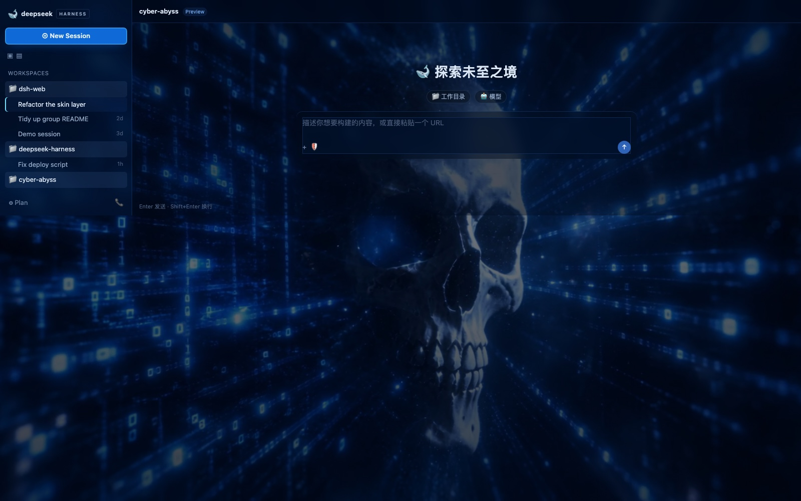

# 深蓝深渊 · 数据流 — Abyssal Current · Data Stream

以**骷髅形状的放射状二进制数据流**为背景的 DSH 皮肤。**16.57 秒无缝循环**，暗色专用。



这是同一套皮肤工程的第二个实例：`skin.css` / `patches.css` 与
[`../cyber-maiden`](../cyber-maiden/README.md) **完全共用**，只有两张东西不同 ——
**调色板**（`../build/palettes/cyber-abyss.json`）和**背景资产**。
换句话说，加一个皮肤 = 一个调色板 JSON + 一段视频，不用写 CSS。

两边的完整工程说明（CSS 白名单约束、token 覆盖、闸门、踩坑记录）见
[cyber-maiden/README.md](../cyber-maiden/README.md)，这里只写这个皮肤特有的部分。

---

## 1. 为什么选这条底片

底片是 `media/deepseek-startup-intro.mp4`（1280x720，8.04s）。选它有两个理由：

**① 它是 6 条里唯一「干净窗口」够长的。** 0.5 秒一格的时间轴：

| 时间 | 画面 | 用途 |
|---|---|---|
| **0.05 – 4.25s** | 骷髅 + 放射状数据流，边缘暗 | ✓ **干净窗口 4.2 秒** |
| 2.5 – 3.0s | 骷髅骤然爆亮 | 循环里变成一次「呼吸」 |
| 3.5s 起 | 少女的脸从右侧进入 | ✗ 混进人物 |
| 4.5s 起 | 左下出现 DeepSeek 手写字标 | ✗ 切掉 |

对比：cyber-maiden 用的 brand 那条只有 **2.3 秒**。窗口长一倍，同样手法就能烤出更长的循环。

**② 它既无播放器 UI，也无烘焙品牌字标。** 6 条素材的完整审计表见
[cyber-maiden/README.md 第 1 节](../cyber-maiden/README.md)——
`promo/` 那两条 1080p 是**播放器录屏**（画面上烧着「跳过」按钮与进度条），
`cyberpunk` / `awakening` 两条左上角有 DeepSeek 字标。

**③ 附加好处**：画面是**抽象放射结构**，当背景比人物特写更不抢注意力——
UI 面板压在上面时，读起来比一张脸更安静。

---

## 2. 循环做法

```sh
SKIN_ID=cyber-abyss build/bake-loop.sh \
  "<media 目录>/deepseek-startup-intro.mp4" 0.05 4.2 pingpong 1600 1 60
```

- `minterpolate=fps=60` → `setpts=2*PTS`：**2 倍运动插值慢放**（4.2s → 8.4s）
- 正放 + 倒放 → **16.57 秒**

这里用 2 倍（而不是 cyber-maiden 的 3 倍），是因为这条画面本身动得多
（数据流在扩张、骷髅在起伏），慢放过头会显得迟滞。

### 实测

| 指标 | 值 | 说明 |
|---|---|---|
| 首帧 / 末帧 YAVG | 48.64 / 48.62 | 两端一致，无黑帧 |
| 首帧 vs 第二帧 PSNR | 34.59 dB | 头部无硬切 |
| 末帧 vs 倒数第二帧 PSNR | 32.33 dB | 尾部无硬切 |
| 首帧 vs 末帧 PSNR | 32.81 dB | boomerang 回折平滑 |
| 分辨率 / 体积 | 1600x900 / 4.26 MiB | 画面细节多，比 cyber-maiden 重 4 倍 |

> 这些 PSNR 比 cyber-maiden 低是**正常的，不是缺陷**：这条画面每帧都在动，
> 相邻帧本身就差得多。判据「端点 vs 邻居」在两类素材上都成立，只是绝对值不可比。
> 4.26 MiB 也不算大——官方上架的 `whale-fantasy` 是 6.63 MiB。

---

## 3. 配色：这条底片是「亮」的，所以设计要反过来

量出来的色相分布：**71.2% 钢蓝（210–240°）+ 28.7% 冷青（180–210°）**，
比 cyber-maiden 更饱和。关键是：

| 来源 | 值 | 说明 |
|---|---|---|
| L<25 聚类（38% 像素） | `#00102D` | **注意：是带蓝的深色，不是近黑** |
| L25–60 聚类中位 | `#022964` | 结构 |
| L60–110 聚类中位 | `#1054B2` | 中间调 —— 鲜蓝 |
| L110+ 聚类中位 | `#7BBBF5` | 高光 |
| 色相 210–240°、sat>0.35 | `#0042A9` | → 品牌蓝 `#0F6AD8` |
| 色相 180–210° | `#68C0F7` | → 状态青 `#6FE3FF` |
| 最亮 1% | `#FCFDFD` | → 正文 `#E4F1FF` |

cyber-maiden 那条画面 **77% 的像素亮度低于 25**（近乎纯黑），所以面板可以很薄；
这条只有 38%，而且中间调是鲜艳的 `#1054B2`。于是做了两处反向调整：

1. **面板压得更深**：`layer1` 从 `#080F1C` 改成 `#02132E`，各层依次更深
2. **scrim 重得多**：从底部的薄纱改成 **40–60% 的整体压暗 + 中心径向压暗**
   （见 `skin.json` 的 `backgroundMedia.scrim`）

第 2 条是必须的：不加纱的话，**鲜艳的背景会把同样鲜艳的按钮吞掉**，
而且欢迎语压在亮数据流上读不清。

---

## 4. 结构

```
cyber-abyss/
├── skin.json          ← v2 清单（含这条特有的强 scrim）
├── skin.css           ← L1：112/112 官方颜色 token，由 build/palettes/cyber-abyss.json 生成
├── patches.css        ← L2/L3：与 cyber-maiden 逐字节相同
├── assets/cyber-abyss-loop.mp4   ← 16.57s，1600x900，4.26 MiB
├── preview/{dark,light}.jpg      ← 走皮肤中心真实 transform 输出的渲染
└── README.md
```

改调色板：编辑 `../build/palettes/cyber-abyss.json`，然后
`python3 build/build-skin.py cyber-abyss`。

## 5. 授权

与 cyber-maiden 一致：**清单里故意没有 `license` 字段**，这条素材的授权由你（作者）决定。
底片是你自有的 `media/deepseek-startup-intro.mp4`。
