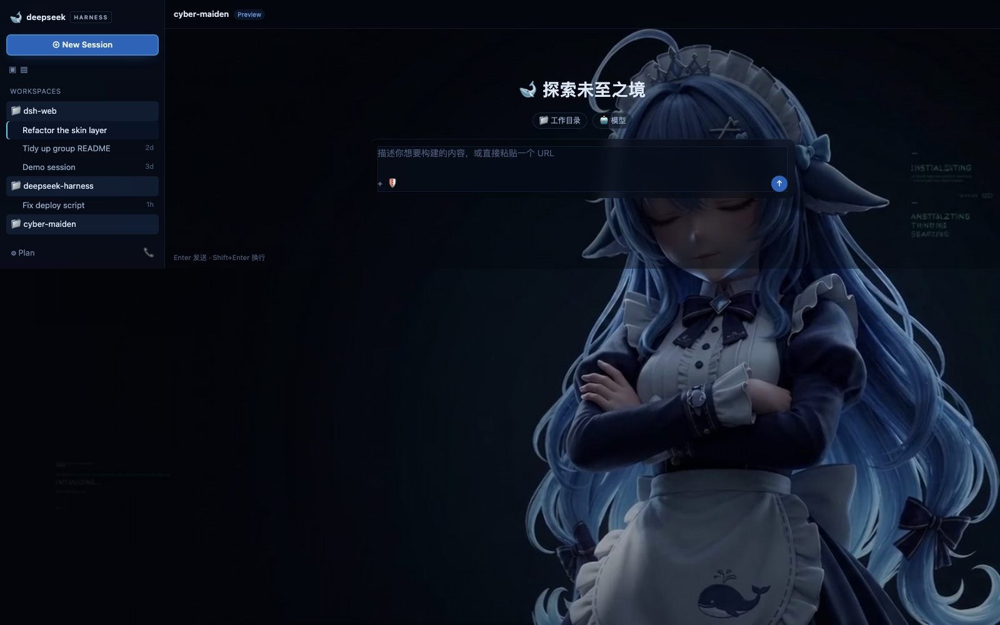

# 赛博少女 · 冷钢之夜 — Cyber Maiden · Cold Steel Night

一条 **13.57 秒无缝循环视频**做 DSH Web GUI 的背景，配色全部从这条视频本身量出来。
暗色专用。这是给 DSH 皮肤中心（skin center）用的 **v2 皮肤**——一个纯资产目录，
没有 `package.json`、不发 npm、不接 cordis 接线。



---

## 1. 底片审计：6 条里只有 1 条能用

你的 6 条片子里，**两条 1080p 宣传版是开机动画播放界面的录屏**——画面里烧进了播放器
自己的 UI（左上「已选片头 · DeepSeek 品牌片头」、右上**「跳过」按钮**、底部
「点击开启声音 · 全屏」、左下进度条）。做背景会把「跳过」按钮印在界面上。

| 文件 | 播放器 UI | 烘焙品牌 | 结论 |
|---|---|---|---|
| **`media/deepseek-brand-intro.mp4`** | 无 | 无 | ✅ **选它** |
| `media/deepseek-cyberpunk-intro.mp4` | 无 | 左上 DeepSeek 大字标 | 品牌字标去不掉 |
| `media/deepseek-awakening-intro.mp4` | 无 | 左上 DeepSeek 字标（从第 0 帧起） | 品牌字标去不掉 |
| `media/deepseek-startup-intro.mp4` | 无 | 无（骷髅 + 数据流） | ✅ 可用，但画面是全屏骷髅 |
| `promo/dsh-intro-brand-1080p.mp4` | ❌ 跳过 + 进度条 | 无 | ✗ 录屏 |
| `promo/dsh-intro-cyberpunk-1080p.mp4` | ❌ 跳过 + 进度条 | DeepSeek 大字标 | ✗ 录屏 |

> 这条审计是被逼出来的：我第一版用了 `promo/dsh-intro-brand-1080p.mp4`（1080p 看起来更好），
> 直到把插值后的一帧放大到全屏才看见「跳过」按钮。**缩略图上根本看不出来**——
> 所以 `build/source-audit/` 里留了 6 张全尺寸截图（第 1.0 秒各抽一帧），换素材前先看一眼。

`media/deepseek-brand-intro.mp4` 里剩下的文字（`INSTTIALIZATING` / `ANSTTALIZTING` /
`THINKING` / `SEARCHING`）是**画面自带的装饰性 HUD 文字**，属于美术的一部分，保留。

---

## 2. 循环是怎么来的

### 边界勘察

| 时间 | 画面 | 用途 |
|---|---|---|
| **0.000s** | 纯黑一帧（有限范围 YUV 下 Y=16.18） | ✗ 切掉 —— 否则循环点闪黑 |
| **0.033s – 2.40s** | 蓝发少女，左半屏是空的深蓝 | ✓ 干净窗口 |
| 2.40s 之后 | DeepSeek 标题卡淡入 | ✗ 切掉 |

干净窗口 2.30 秒。三条死路先排除掉了：

- **交叉淡化循环** → 只剩 `2.30 - 0.9 = 1.4s`，太短
- **裁掉标题卡** → 标题右边缘到画面的 **41%**，而少女在 **30%–70%**，**位置重叠，裁不干净**
- **拼接多镜头** → 另一条 1080p 的 DeepSeek 是**居中大字**（不是我量的左侧小字），
  任何窗口都带字标

所以走 **boomerang + 运动插值慢放**：

```sh
build/bake-loop.sh media/deepseek-brand-intro.mp4 0.1 2.3 pingpong 1600 1 90
```

展开就是：

```
-ss 0.1 -t 2.3 -i 底片 -an \
  -vf "minterpolate=fps=90:mi_mode=mci:mc_mode=aobmc:me_mode=bidir:vsbmc=1,setpts=3*PTS,
       split[a][b];[b]reverse[r];[a][r]concat=n=2:v=1:a=0,scale=1600:-2:flags=lanczos,fps=30" \
  -c:v libx264 -preset slow -crf 24 -pix_fmt yuv420p -movflags +faststart
```

- `minterpolate=fps=90` 把 2.3s 插值成 3 倍帧数（**生成**中间帧，不是重复帧）
- `setpts=3*PTS` 把时间轴拉长 3 倍 → 6.9 秒的**平滑**慢动作
- 再正放 + 倒放 → **13.57 秒**，结构上就无缝

### 为什么不用「重复帧」放慢

同一个 0.45x，两种做法实测差得很明显：

| 做法 | 有实际变化的帧对 | 单帧跳变 / 中位 |
|---|---|---|
| `speed 0.45`（重复帧） | **48%** → 每帧被撑到 2.1 个输出帧，有顿感 | 3.4 |
| `interp 90`（3x，运动插值） | **75%** → 平滑 | 2.6 |

`bake-loop.sh` 两个都支持，建议用 `interp`。

### 无缝性是量出来的

| 指标 | 值 | 含义 |
|---|---|---|
| 首帧 / 末帧 YAVG | 33.34 / 33.40 | 两端亮度一致，无黑帧 |
| 首帧 vs 第二帧 PSNR | 55.32 dB | 头部无硬切 |
| 末帧 vs 倒数第二帧 PSNR | 51.43 dB | 尾部无硬切 |
| 首帧 vs 末帧 PSNR | 40.27 dB | boomerang 回折平滑 |

`bake-loop.sh` 每次烤完都会自动算这四个数并给出 `seamless` / `suspect` / `REJECTED` 判决。

> **踩过的坑，换片时会再遇到**：
> ① 底片**第 0 帧是黑帧**。我第一次用「首帧 vs 末帧的平均差」验出 0.008 就以为过了——
> 那其实是**两个都偏黑的帧互相比**（假阳性）。真正抓到它的是「端点 vs 邻居」硬切检测。
> ② 有限范围 YUV 下**纯黑的 Y 是 16 不是 0**，所以亮度守卫的阈值不能设成 0。
> ③ `-sseof -0.1` 抽末帧抽到的是倒数第 4 帧（0.1s = 3 帧），必须用 `reverse` 滤镜。
> 而按「0.4 帧之前」取又会因为容器时长超过末帧 PTS 导致一帧都不出。所以现在用 `reverse`。

---

## 3. 配色是量出来的

从循环里采 15 帧、共 116 万像素聚类：

| 来源 | 值 | 用途 |
|---|---|---|
| L<25 聚类（占 77% 像素） | `#01050B` | 夜底 |
| L25–60 聚类中位 | `#1A2D49` | 结构线 |
| L60–110 聚类中位 | `#425673` | 中间调 |
| L110+ 聚类中位 | `#748CAB` | 高光 |
| **色相 210–240°、饱和度 >0.35 最饱和处** | `#193D6D` | → 提亮成品牌蓝 `#2F63B8` |
| 色相 180–210° 一族（占彩色像素 15.5%） | `#547294` | → 提亮成状态青 `#5FD0E6` |
| 最亮 1% | `#B8C1D2` | → 提亮成正文 `#DCE7F5` |

色相普查：中高亮有彩像素里 **83.4% 落在 210–240°（钢蓝）**、**15.5% 落在 180–210°（冷青）**，
画面里**没有暖色**——所以这个皮肤是「结构上冷色」的，不是我挑的。

### 视觉语言

> 「夜里的一块冷钢玻璃」：**面**是薄玻璃（背后永远有画面在动），**骨**是 1px 冷蓝线，
> **青**只给状态。

- 全屏**唯一的实心**是新会话那颗钢蓝按钮
- 青色只出现在：当前行（左侧 2px 竖条）、聚焦中的输入卡、链接、选中文本
- 所有规则只碰**绘制属性**（color / background / border-color / box-shadow / outline /
  filter / transition），**绝不碰 margin / padding / size / position**——
  皮肤永远没有能力移动官方壳层

---

## 4. 目录结构

```
cyber-maiden/
├── skin.json          ← v2 清单（fail-closed 校验）
├── skin.css           ← L1：全部 112 个官方颜色 token（由 build/build-skin.py 生成）
├── patches.css        ← L2/L3：玻璃 + 冷蓝线语言，只挂 L2 语义属性
├── assets/
│   └── cyber-maiden-loop.mp4   ← 13.57s 无缝循环，1600x900，1.03 MiB
├── preview/
│   ├── dark.jpg       ← headless Chrome 渲染，CSS 走的是皮肤中心真实的 transform 输出
│   └── light.jpg      ← 同上但去掉 data-ds-dark-theme。两张字节相同 = 无浅色模式泄漏
└── README.md
```

`skin.css` 是**生成物**，不要手改——调色板在 `../build/build-skin.py` 里，
改完重新 `python3 build/build-skin.py`。

### token 覆盖

官方注册表（`official-tokens-v1.json`，0.1.7-rc.1）里有 **299 个 `--dsw-*` token**，
其中颜色相关的 **112 个全部被这个皮肤显式声明**（92 个 `--dsw-alias-*` +
11 个 `--dsw-specific-*` + 9 个其它）。覆盖率 **112/112 = 零遗漏**，所以皮肤中心的自动兜底
（`deriveFallbackTokens`）**一个都不用触发**——不会出现「某个新面悄悄退回官方灰蓝」。

只有 4 个结构型 token 故意不碰，交给官方：`--dsw-corner-shape`、
`--dsw-elevation-panel` / `-prominent` / `-soft`（它们不是颜色，猜错会把阴影写坏）。

---

## 5. 怎么验证

`../build/validate-skin.mjs` **直接跑皮肤中心的真校验器**（`validator/` 下是
`zhu1090093659/dsh-skins` 的逐字节拷贝），不是我自己写的一套宽松检查：

```sh
node build/validate-skin.mjs cyber-maiden
```

四项闸门：`validateSkinManifestV2` → `transformSkinCss(skin.css, deriveFallbacks)`
→ `transformSkinCss(patches.css)` → 清单里每个文件引用都存在。当前结果：**全部 PASS**，
并断言了加载器的三处改写确实生效（`html[data-dsh-skin]` 作用域、
`[id="root"] { background: transparent }`、`--shiki-background` 重绑）。

> 校验器本身也用官方已上架的 `whale-fantasy` 做过对照——**那份也全绿**，
> 所以这套闸门不是「来者不拒」；它此前确实拦下过缺失的 preview 引用。

---

## 6. 换一条片子重烤

```sh
# usage: bake-loop.sh <source> [start] [duration] [mode] [width] [speed] [interp]
bash build/bake-loop.sh "<你的 media 目录>/deepseek-startup-intro.mp4" 0.5 4.0 pingpong 1600 1 90
```

烤完自动量首末帧亮度 + 端点硬切 PSNR，给出 `seamless` / `suspect` / `REJECTED`。
**遇到 `REJECTED` 说明窗口两端有黑帧或拼接帧，把 `start` 往后挪或 `duration` 收短。**

烤完连着跑：

```sh
python3 build/build-skin.py          # 只有改了配色才需要
node build/validate-skin.mjs cyber-maiden
node build/render-preview.mjs        # 重出预览图
```

> **还能更长。** `media/deepseek-startup-intro.mp4`（骷髅 + 数据流）完全无播放器 UI、
> 也无烘焙品牌字标，而且画面是**抽象放射状结构**——当背景其实比人物特写更合适。
> 它的干净窗口比 brand 那条长得多，同样手法能烤出 20 秒级的循环。想换的话一条命令。

---

## 7. 授权

**清单里故意没有 `license` / `licenseUrl` 字段** —— 这条素材的授权该由你（作者）决定，
我不替你选。要补的话在 `skin.json` 顶层加两行即可：

```json
"license": "CC BY-NC-SA 4.0",
"licenseUrl": "https://creativecommons.org/licenses/by-nc-sa/4.0/"
```

一个参考：官方市场的 `whale-fantasy` / `rainy-night` 用的是 CC BY-NC-SA 4.0，
但它们的作者额外声明「**美术素材不在 CC BY-NC-SA 的授权范围内**，角色归作者所有」。
如果你的视频是 AI 生成的，那句声明的措辞值得照抄（生成式素材的权属在各平台仍不清晰）。

皮肤的 CSS / token 映射 / 量色流程是我原创的，你可以随意处置。
